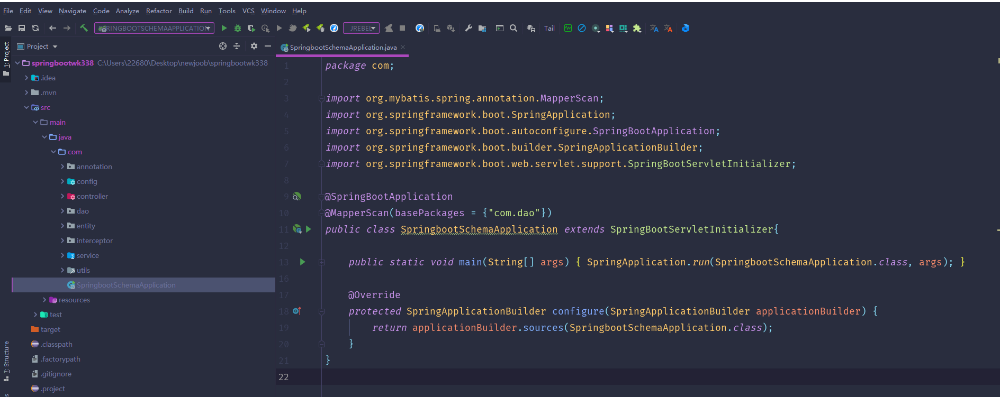
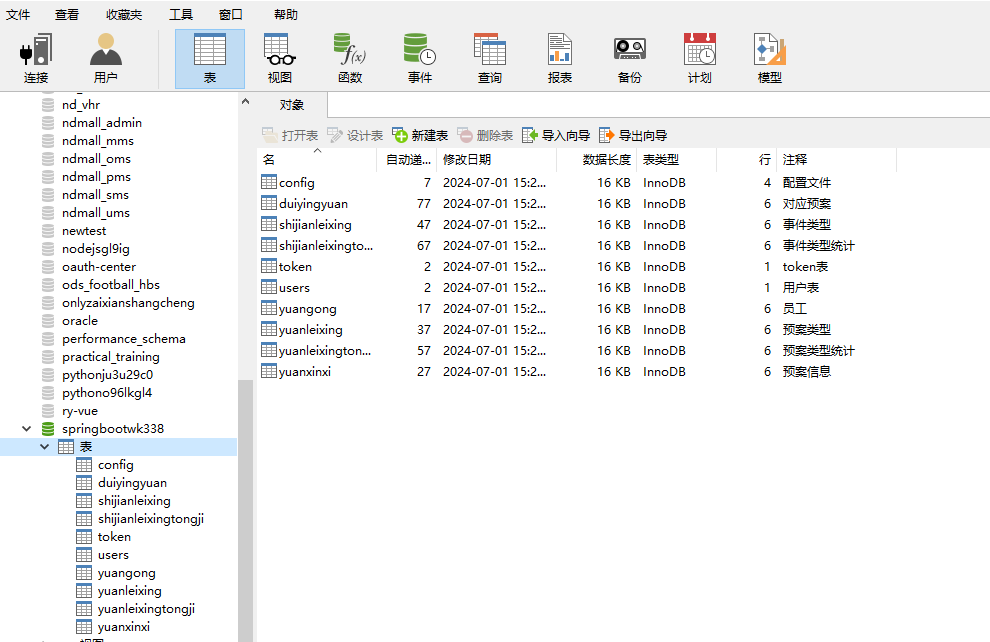
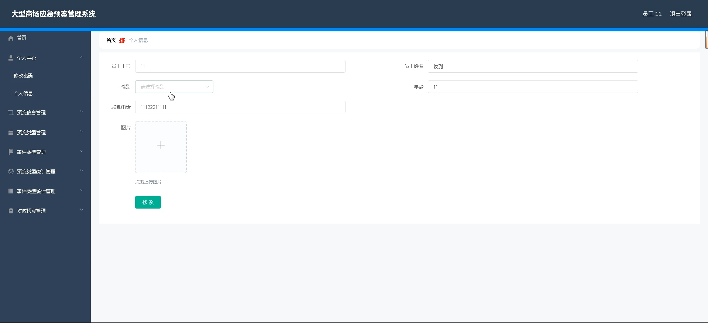
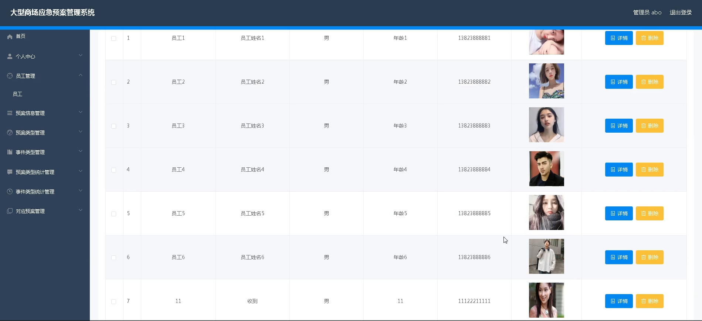
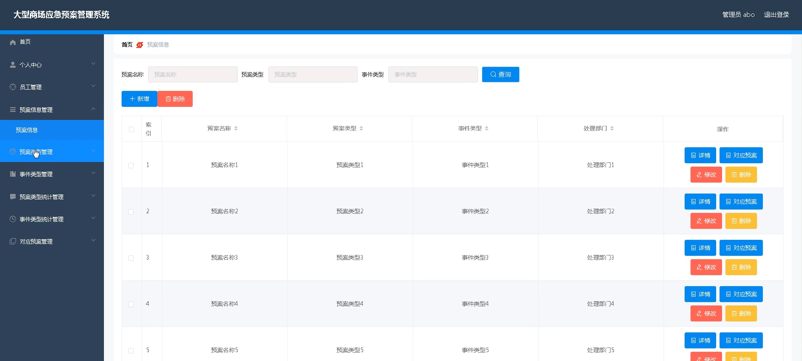
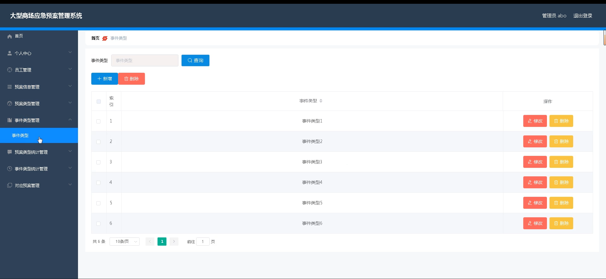
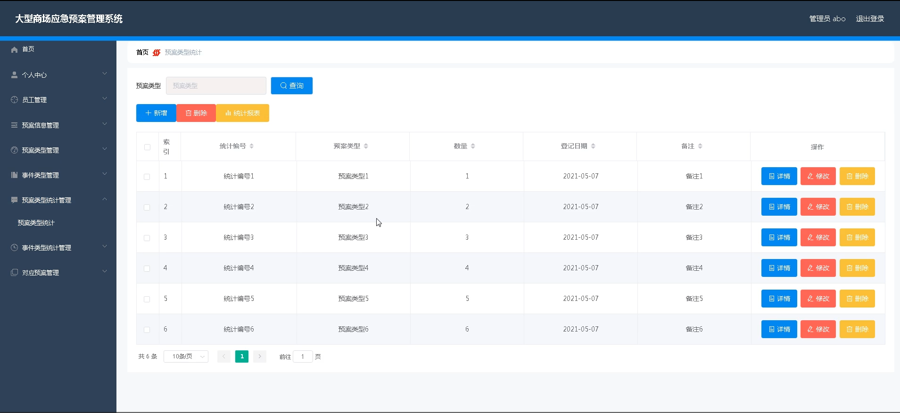
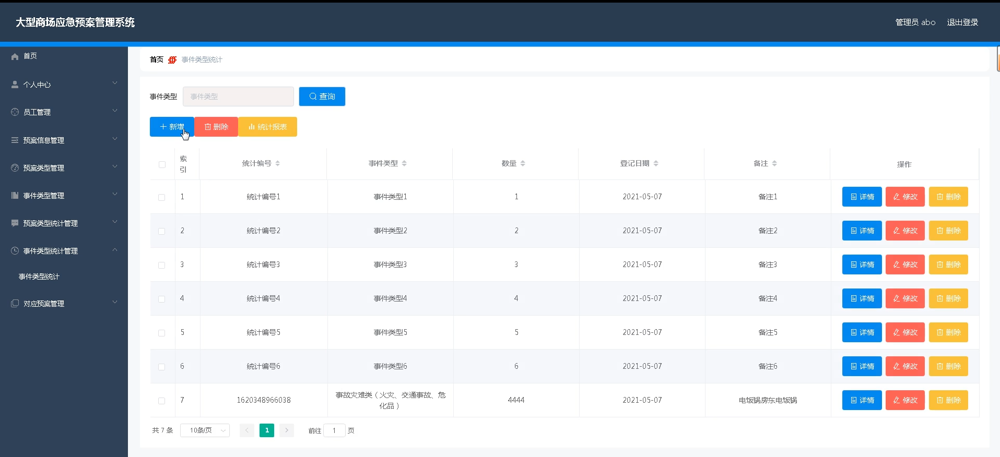
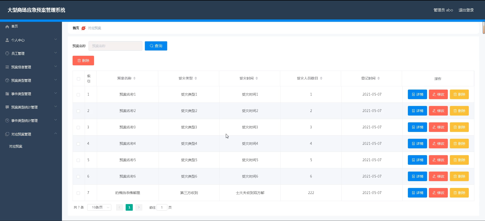

# 基于springboot的大型商场应急预案管理系统

---
### 👉作者QQ ：1556708905 微信：zheng0123Long (支持定制修改、部署调试、定制毕设)

### 👉接网站建设、小程序、H5、APP、各种系统等

---

#### 介绍

基于SpringBoot的大型商场应急预案管理系统旨在为大型商场提供一个全面、高效的应急预案管理平台。该系统涵盖了从预案的创建、分类、统计到事件的分类和处理等多个方面的功能，确保在紧急情况下能够迅速响应并采取有效措施。系统拥有管理员和用户两种角色，每种角色有不同的功能模块，通过明确的权限管理确保系统的安全性和有效性。

#### 技术栈

后端技术栈：Springboot+Mysql+Maven

前端技术栈：Vue+Html+Css+Javascript+ElementUI

开发工具：Idea+Vscode+Navicate

#### 系统功能介绍

管理员角色功能模块：  
个人中心：管理员可以管理个人信息，修改密码等。  
员工管理：管理商场所有员工的信息，包括员工的联系方式、职责分配等。  
预案信息管理：创建、编辑和删除应急预案，确保预案信息的及时更新和准确性。  
预案类型管理：管理不同类型的应急预案，方便分类和查找。  
事件类型管理：定义和管理各种可能发生的事件类型，为应急预案的制定提供依据。  
预案类型统计管理：对不同类型的预案进行统计分析，提供数据支持。  
事件类型统计管理：对不同类型的事件进行统计分析，帮助预案的优化和调整。  
对应预案管理：根据不同事件类型制定对应的应急预案，确保在紧急情况下有明确的处理方案。  

用户角色功能模块：  
个人中心：用户可以管理个人信息，修改密码等。  
预案信息管理：用户可以查看和学习应急预案的详细信息，了解应急措施和流程。  
预案类型管理：用户可以查看不同类型的应急预案，了解不同情况下的应对措施。  
事件类型管理：用户可以查看各种事件类型的信息，了解可能发生的紧急情况及其处理方法。  
预案类型统计管理：用户可以查看不同类型预案的统计数据，了解预案的使用情况和效果。  
事件类型统计管理：用户可以查看不同事件类型的统计数据，了解事件的发生频率和处理效果。  
对应预案管理：用户可以查看针对不同事件类型的应急预案，熟悉各种紧急情况的处理流程。  

#### 系统作用

提高应急响应效率：通过系统化管理应急预案和事件类型，确保在紧急情况下能够迅速响应并采取有效措施。  
优化预案管理：系统提供详细的预案和事件类型统计分析，帮助管理人员优化和调整应急预案，提高预案的实用性和有效性。  
加强员工培训：通过系统的预案信息和事件类型管理，帮助员工熟悉各种应急预案和处理流程，提高员工的应急处理能力。  
保障商场安全：系统化的应急预案管理，有助于提高商场的整体安全水平，确保在突发事件中能够最大限度地减少损失和伤害。  

#### 系统功能截图

代码结构

数据库表

登录

员工端个人信息

管理员端员工管理

预案信息管理

事件类型管理

预定类型统计管理

事件类型统计管理

对应预案管理

#### 总结

基于SpringBoot的大型商场应急预案管理系统为商场的应急管理提供了一个全面、高效的解决方案。通过详细的功能模块设计和明确的角色分工，系统确保了应急预案的及时更新和有效实施。同时，系统的统计分析功能帮助管理人员不断优化预案，提高应急响应效率。该系统不仅提高了商场的安全管理水平，也为员工和用户提供了一个学习和了解应急处理措施的平台，为商场的安全运营保驾护航。

#### 使用说明

创建数据库，执行数据库脚本 修改jdbc数据库连接参数 下载安装maven依赖jar 启动idea中的springboot项目

后台地址：http://localhost:8080/springbootwk338/admin/dist/index.html

管理员  abo 密码 abo

